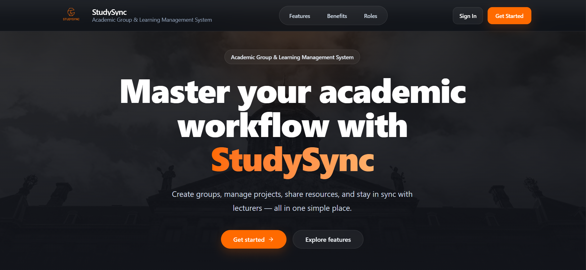
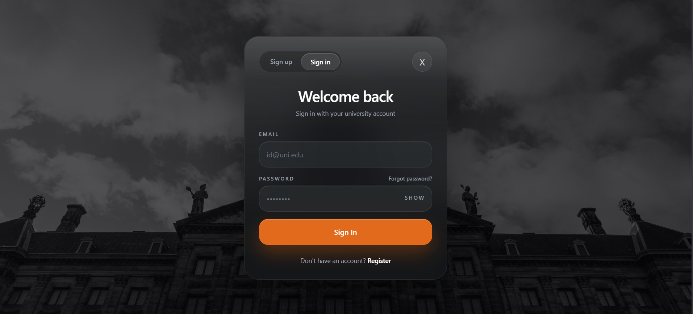
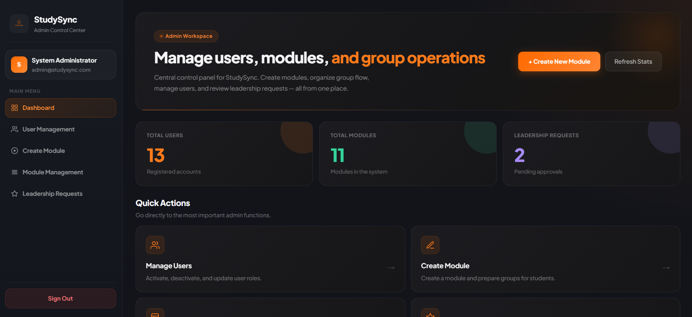
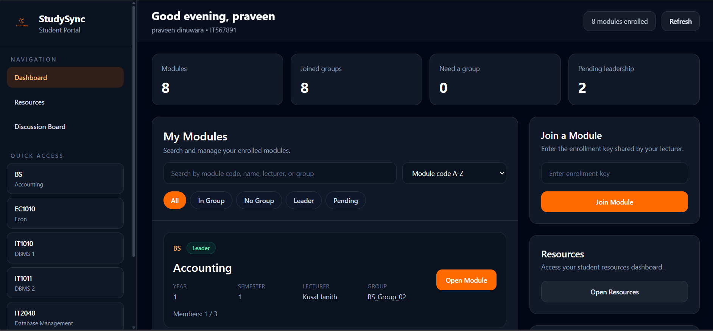
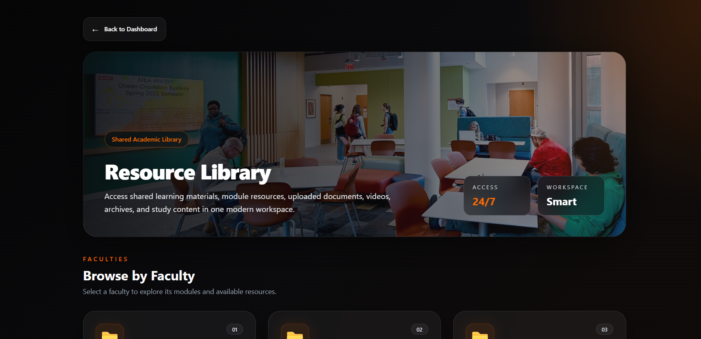

# StudySync


## StudySync – Academic Group & Learning Management System

StudySync is a web-based academic management platform designed to support structured university group formation, lecturer coordination, project workflow tracking, discussion-based collaboration, and shared learning resources.

It brings academic administration and student teamwork into one centralized system.

---

## Project Overview

The system was developed to address common academic management issues such as:

- unstructured student grouping
- poor communication between lecturers and student groups
- lack of contribution tracking
- scattered learning resources
- limited support for collaborative learning

StudySync provides a structured, role-based environment for students, lecturers, and administrators.

---

## Key Features

### Member 1 - Dinuwara M.T.P – Access Control & Group Administration
- Student and lecturer registration
- Secure login authentication
- Role-based access control
- Admin dashboard and user management
- Module and grouping management

### Member 2 - Rathnayaka P.S – Collaborative Learning & Discussion
- Resource upload and management
- Resource filtering by faculty and module
- Discussion board with posts, comments, and attachments
- Shared academic resource access

### Member 3 - Himasha M.A.D – Lecturer Academic & Evaluation
- Group-specific notices
- Viva session scheduling
- Assignment management
- Rubric-based evaluation
- Academic monitoring support

### Member 4 – Sankalana M.K.M - Group Project Management
- Task creation and assignment
- Task status workflow
- Deadline tracking
- Progress monitoring
- Filtering and priority management

---

## System Roles

### Admin
- manages users
- creates modules
- creates groups
- assigns lecturers
- approves leadership requests

### Lecturer
- manages academic communication
- uploads resources
- supports evaluation-related workflows
- monitors academic activities

### Student
- registers and logs in
- enrolls in modules
- joins groups
- requests leadership
- accesses resources
- participates in discussions
- collaborates on project work

---

## Tech Stack

### Frontend
- React
- Vite
- Tailwind CSS
- React Router
- Axios

### Backend
- Spring Boot
- Spring Web
- Spring Data JPA
- Spring Security
- MySQL
- Lombok

### Tools
- Git & GitHub
- Trello
- Postman

---

## System Architecture

The system follows this flow:

**Frontend component/page → frontend service → backend controller → backend service → repository → database**

- the frontend handles UI and user interaction
- controllers receive API requests
- services process business logic
- repositories interact with the database
- models define the system entities

---

## Project Structure

### Frontend
```text
frontend/
├── public/
├── src/
│   ├── assets/
│   ├── components/
│   ├── context/
│   ├── pages/
│   ├── services/
│   ├── App.jsx
│   ├── main.jsx
│   └── index.css
├── package.json
└── vite.config.js
```

### Backend
```text
backend/
├── src/
│   ├── main/
│   │   ├── java/com/StudySync/backend/
│   │   │   ├── config/
│   │   │   ├── controller/
│   │   │   ├── dto/
│   │   │   ├── model/
│   │   │   ├── repository/
│   │   │   ├── service/
│   │   │   └── BackendApplication.java
│   │   └── resources/
│   │       └── application.properties
├── uploads/
└── pom.xml
```

---

## Screenshots


### Landing Page


### Login Page


### Admin Dashboard


### Student Dashboard


### Resource Management



---

## Environment Variables

The backend uses environment variables for sensitive credentials.

### Required Backend Variables
```text
DB_URL=jdbc:mysql://localhost:3306/studysync_db
DB_USERNAME=your_db_username
DB_PASSWORD=your_db_password
MAIL_USERNAME=your_email@gmail.com
MAIL_PASSWORD=your_app_password
FRONTEND_BASE_URL=http://localhost:5173
```

---

## Backend Setup

### Prerequisites
- Java 17+
- Maven
- MySQL

### Run Backend
```bash
./mvnw spring-boot:run
```

Default backend port:
```text
http://localhost:8090
```

---

## Frontend Setup

### Prerequisites
- Node.js
- npm

### Run Frontend
```bash
npm install
npm run dev
```

Default frontend port:
```text
http://localhost:5173
```

---

## API Modules

### User APIs
- register user
- login user
- forgot password
- reset password
- update user role
- update user status

### Admin APIs
- create module
- get modules
- assign lecturer to module
- create groups for modules
- approve leadership requests

### Group APIs
- enroll in module
- get student modules
- join group
- request leadership

### Resource APIs
- upload resource
- update resource
- download resource
- delete resource

### Discussion APIs
- create post
- update post
- delete post
- like and unlike posts
- add comments
- toggle comments
- pin comments

---

## Testing

The project was tested using:

- Postman for API testing
- manual UI validation for frontend workflows

Main tested areas include:
- user registration and login
- admin and group management
- resource management
- discussion board functionality
- lecturer and project management workflows

---

## Project Management & Version Control

- **Trello** was used for task planning and tracking
- **GitHub** was used for source control and collaboration
- **Postman** was used to organize and run API test cases

---

## Team Contributions

- **Member 1** – Access Control & Group Administration
- **Member 2** – Collaborative Learning & Discussion
- **Member 3** – Lecturer Academic & Evaluation
- **Member 4** – Group Project Management

---

## Security Note

Sensitive values such as database passwords and email credentials are not stored directly in the repository and should be provided through environment variables.

---

## Conclusion

StudySync provides a structured academic environment that improves:

- group coordination
- lecturer control
- collaborative learning
- resource sharing
- project accountability

It integrates academic administration and student teamwork into one web-based platform.